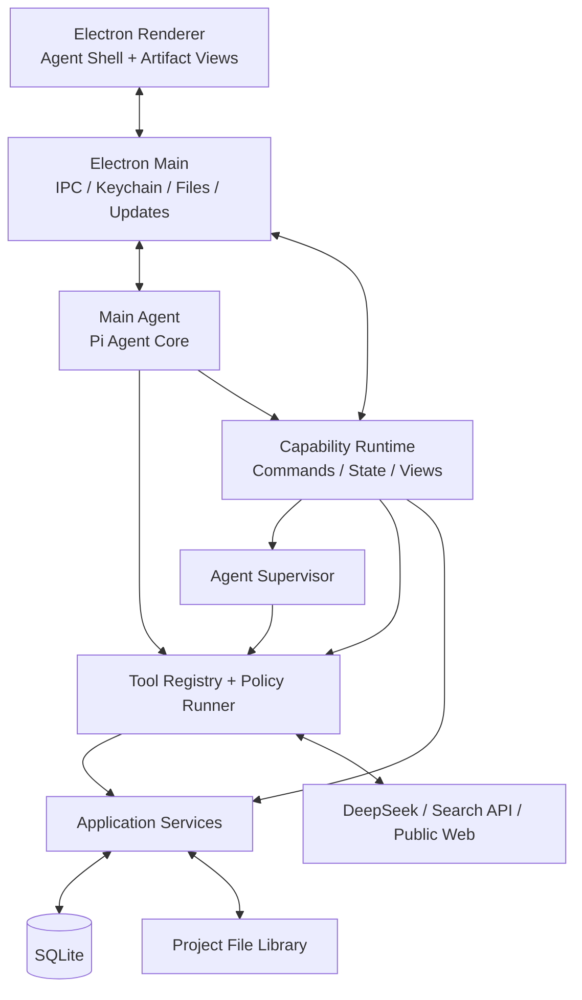

# Deepfield Agent-native 财经研究系统设计

日期：2026-08-25  
状态：已完成对话评审，等待书面规格复核

## 1. 产品定义

Deepfield 是供一名财经记者私人使用的 Apple Silicon macOS 桌面应用。产品首先是一个通用主 Agent；Tools 是可复用的原子操作；Capabilities 是 Agent 原生、可持久化、可验证的高级业务能力。

首轮只交付 Capability A：行业公司发现与深度研究。Capability B（每日科技情报）只保留扩展接口，不在首轮实现。

产品采用两种等价入口：

- 用户可以在 Chat 中要求主 Agent 调用 Capability。
- 用户可以直接点击 Capability 页面，用表单和按钮完成全部流程，不必使用 Chat。

两种入口调用同一套应用服务、状态、子 Agent、Tools 和数据。主 Agent 不是 Capability 的运行前提。

## 2. 首轮目标

Capability A 必须支持：

1. 输入一个行业名称及可选范围，尽可能广泛地发现全球有影响力的公司。
2. 候选公司覆盖上市龙头、非上市领军者、新兴公司和关键产业链参与者，并允许人工筛选。
3. 使用项目统一字段模板批量生成公司报告；单家公司后续可独立增删字段。
4. 每条系统生成的正式事实都绑定可点击、可定位、实际支撑正文的来源。
5. 证据不足、引文失效或不匹配的内容进入待核实区，不混入正式报告。
6. 基于已验证公司报告生成公司对比和行业汇总。
7. 用户可人工编辑、补充字段、增量更新和刷新汇总；人工修改视为记者已确认，不被自动覆盖。
8. 研究任务可暂停、恢复、重试，并在应用重启后从检查点继续。
9. 用“人形机器人”完成不读取记者旧文章的真实盲测。

## 3. 明确不做

首轮不实现：

- Capability B、社交媒体采集和每日看板；
- 浏览器自动搜索、登录态、付费数据库连接器；
- 绕过登录墙、验证码或网站访问限制；
- 多用户、账号、云同步和远程业务服务器；
- Intel Mac、Windows 和 Linux；
- 多语言专项工作流；
- 复杂母子公司或品牌知识图谱；
- 任意终端、任意文件系统或不受控网络访问；
- 面向用户的多模型选择界面；
- PDF 导出、单家公司批量 Word 导出；
- 完整网页快照长期保存；
- 公司研究并行化；
- 无人工筛选的一键全流程模式。

历史文章字段提取也不属于本项目。若以后需要，由单独的 Codex 任务分析文章并产出候选字段清单。

## 4. 技术基线与交付

### 4.1 桌面技术

- Electron + React + TypeScript。
- 使用 `@earendil-works/pi-agent-core` 和 `@earendil-works/pi-ai`，不 fork Pi 全仓库。
- DeepSeek 是首版模型 Provider，用户填写自己的 API Key。
- 搜索 Provider 通过统一接口接入；首个 Provider 在人形机器人查询基准中选定。
- SQLite 保存结构化业务数据。
- API Key 只保存在 macOS 钥匙串。
- Agent 与长任务运行在 Electron utility process，Renderer 不直接接触文件、数据库、密钥或任意网络。
- 内部通过安全 IPC 通信，不开放 localhost 端口。

### 4.2 最终交付

- 目标设备：M3 等 Apple Silicon Mac。
- 交付物：签名并公证的 `Deepfield.dmg`。
- 用户无需安装 Node.js、Pi、数据库或任何开发工具。
- 首次启动只需配置 DeepSeek 和搜索 API Key。
- 应用支持保留数据的更新与数据库迁移。

## 5. Agent-native 产品模型

### 5.1 四个基本概念

| 概念 | 定义 |
| --- | --- |
| Chat | 主 Agent 不执行外部操作的普通对话 |
| Tool | 单次、原子、可校验的执行操作 |
| Capability | 持久化、多步骤、可暂停恢复的 Agent 业务能力 |
| Job | Capability 或子 Agent 的一次持久化任务 |

Capability 类似“产品级 Skill”，但不是 Pi Skill，也不只是提示词。每个 Capability 定义：

- Agent 身份与指令；
- 输入和状态 Schema；
- 子 Agent 拓扑；
- 可使用的 ToolSet；
- 命令、验证门和事件协议；
- 持久化状态和检查点；
- 专属 Artifact 页面。

主 Agent 每轮可以选择：纯 Chat、调用一个或多个 Tools，或启动/推进 Capability。

### 5.2 自适应界面

应用不是固定的“Chat 左栏 + 功能右栏”。默认是左侧导航与中央自适应主画布：

- 普通对话时，中央画布是完整 Chat。
- 直接点击 Capability 时，中央画布是 Capability 工作区，Chat 默认不出现。
- Chat 启动 Capability 后，Capability 占据中央画布，原 Chat 缩为可调整宽度、可折叠的右侧纵向栏。
- Capability 完成后，中央画布展示行业汇总和公司报告；右侧 Chat 可继续指挥、解释或发起维护任务。

左侧导航包含：新对话、对话历史、行业研究、公司库、项目资料库、任务中心和设置。

底部输入区允许用户显式选择 Chat、Capability 或 Tools；未选择时主 Agent 可建议使用适合的能力，但耗时或写入操作仍需确认。

### 5.3 直接使用 Capability

每个项目创建时同步创建一个空的 `ProjectConversation`，但不会启动主 Agent，也不会产生 LLM 调用。空会话不出现在最近 Chat 历史中。

用户以后展开 Chat 时，系统按需创建主 Agent Runtime，并从项目状态、重要事件、当前页面和最近对话组装上下文。用户从未使用 Chat 时，Capability 仍可完整运行。

## 6. 系统架构



Renderer 只负责输入、展示和本地交互。主进程负责系统权限。Capability Runtime 管理业务状态，Agent Supervisor 管理子 Agent，Tool Runner 统一控制所有原子操作，Application Services 负责事务和领域规则。

## 7. 多 Agent 设计

这是受控、分层、任务型的多 Agent 系统，不是多个 Agent 自由讨论的群体系统。

### 7.1 角色

- Main Agent：用户对话、意图判断、调用 Tools 或 Capabilities。
- Discovery Agent：一轮行业候选公司发现。
- Company Research Agent：一个 `ResearchCycle × ProjectCompany` 对应一个隔离任务上下文。
- Field Research Agent：对一家公司一个或少量字段进行短生命周期补充研究。
- Summary Agent：只读取已验证公司报告，生成行业汇总。

Capability Orchestrator 和 Agent Supervisor 是确定性后端代码，不是 LLM Agent。

### 7.2 Pi 集成

Pi 没有内置父子 Agent 调度框架。本项目使用 Pi Core 创建多个独立 `Agent` 实例，并自行实现：

- `AgentRoleDefinition`；
- `AgentJob`；
- `AgentSupervisor`；
- ToolSet 与权限；
- 最大轮次、Tool 调用和取消信号；
- 状态、检查点和结构化输出校验；
- 项目事件回传。

子 Agent 不是 Tool。主 Agent 可以通过高层 Capability 命令创建 Job；Supervisor 再为 Job 创建子 Agent。长任务创建后立即返回 `jobId`，不会长期阻塞一次 Tool 调用。

### 7.3 Agent 通信

Agent 不直接随意互发消息，而是通过结构化输入、数据库 Artifact 和项目事件交换结果：

```text
Job 输入快照 → Agent 执行 → 结构化输出 → 数据库 → ProjectActivityEvent
```

数据库是长期记忆；Agent 上下文只是当前任务的工作记忆。未来补充研究会创建新 Agent，并从数据库构建最新上下文，不恢复数月前的长对话。

## 8. Tool Platform

### 8.1 Tool 原则

Tool 是可复用、可审计的执行边界。Capability 不直接写死搜索、抓取、解析或导出实现，而是统一经过 Tool Runner。

每个 Tool 包含：名称和版本、输入输出 Schema、权限、超时、重试、并发限制、进度事件、错误类型和执行器。

首版 Tools：

- `search_web`
- `fetch_url`
- `fetch_pdf`
- `parse_html`
- `parse_pdf`
- `check_link_accessibility`
- `read_imported_file`
- `get_project`
- `get_company_report`
- `open_external_link`
- `export_word`

主 Agent、Capability 和子 Agent 共用 Tool 实现，但通过不同 ToolSet 控制可见范围。Capability 可由代码直接调用 Tool Runner，不要求每次都由 LLM 发起。

纯内部计算不 Tool 化，例如字段排序、进度计算、实体映射和事务写入。

### 8.2 Tool 执行链路

```text
调用 → 输入校验 → ToolSet/权限/预算检查 → 必要确认
→ 执行 → 输出校验 → 日志与成本 → 结构化结果
```

网络 Tool 只访问公开 HTTP/HTTPS；禁止本机、局域网、私有 IP、`file:` 和 `data:`；不携带浏览器 Cookie；限制重定向、响应大小和超时；首版只接受 HTML 与 PDF；不绕过登录或验证码。

## 9. Capability A 生命周期

### 9.1 完整研究周期

一轮 `ResearchCycle`：

```text
创建项目 → 发现公司 → 用户筛选 → 确认项目模板
→ 批量公司调研 → 行业汇总 → completed
```

行业汇总完成即代表本轮调研结束。除非用户选择全部重做，否则不会重新打开原周期。

通用 Run 状态：

```text
created → queued → running → waiting_for_user → completed
paused / completed_with_errors / failed / canceled
```

### 9.2 创建项目

行业名称必填；关注技术、产品形态、地域、时间、排除范围和自定义要求选填。时间窗口由字段模板定义，不写死统一回溯年限。

创建只落库，不自动联网。项目从系统默认字段模板开始；用户修改后形成项目模板。项目模板后来修改时只影响未来新增公司，已有公司需通过一键同步显式补充。

### 9.3 公司发现

默认最多三轮：广泛发现、补充类别和别名、填补产业链与新兴公司缺口。

初始安全预算：每轮最多 10 个搜索查询、20 个实际抓取页面。预算是可配置上限，盲测后可下调或调整。

候选公司至少保留一个可打开的发现来源。普通媒体和社交内容可作为发现线索，但不因此成为正式报告证据。

名称、官网和别名高度一致时自动去重；不确定时提示用户，不自动合并。

### 9.4 人工筛选和模板快照

候选公司支持分类、统一排序、国籍和产业链筛选。分类是可编辑辅助标签，不视为客观结论。

用户确认公司及字段后，生成不可变批次输入快照。运行中修改项目模板不会改变已启动批次。

### 9.5 公司研究

每家公司独立运行 Company Research Agent。首版顺序执行，便于调试耗时、成本和错误。

每家公司默认最多三轮；每轮最多 8 个搜索查询和 15 个抓取页面。网络传输重试和 LLM Schema 重试不计入研究轮次，分别最多两次。

处理顺序：

1. 根据字段生成检索计划。
2. 搜索网页目录。
3. 判断需要读取的页面。
4. Tool 实际抓取并解析 HTML/PDF。
5. 先提取事实、原文摘录和来源。
6. 后端验证链接、元数据和引用结构。
7. 只根据已验证证据生成 Claim。
8. 再验证 Claim 与摘录的语义匹配。
9. 证据不足时进入下一轮。
10. 达到上限仍不足则进入待核实区。

单家公司失败不会阻塞其他公司。总体进度按完成公司数计算，并显示当前公司、字段和阶段文字。

### 9.6 行业汇总

Summary Agent 只能读取当前有效公司字段、有效引用、人工确认内容和项目范围，不提供搜索或抓取 Tools。

部分公司失败时，系统先提示用户；用户可重试或明确基于已完成公司生成汇总。公司报告后来更新时，原汇总标记为基础数据已变化，不自动覆盖。

### 9.7 完成后的维护 Job

完整周期完成后，维护操作是独立 Job，不改变 `ResearchCycle.completed`：

- `FieldResearchJob`
- `CompanyUpdateJob`
- `SummaryRefreshJob`
- `TemplateSyncJob`

单纯添加空字段、删除字段或人工编辑只产生数据库版本，不创建复杂 Job。涉及联网、多轮 LLM、失败恢复或用户确认时才持久化 Job。

页面直接创建的 Job 由 Capability 管理，重要结果通过事件通知主 Agent。它可以创建临时专用子 Agent，但不要求主 Agent 在线。

## 10. 数据模型

### 10.1 核心实体

- `ResearchProject`：行业范围、模板、公司、汇总、Chat 和资料库。
- `Company`：全局唯一公司身份、别名、国籍、官网、上市信息和可选关系说明。
- `ProjectCompany`：公司在特定项目中的研究档案。
- `ProjectTemplateVersion` / `TemplateField`：项目字段模板版本。
- `ReportField` / `FieldRevision`：字段及其历史版本。
- `Claim`：可独立验证的事实陈述。
- `Source` / `EvidenceFragment` / `Citation`：来源、摘录和引用关系。
- `PendingEvidenceItem`：待核实内容。
- `IndustrySummaryVersion`：行业汇总版本及其基础报告版本。
- `ResearchCycle` / `AgentJob` / `WorkflowStep`：持久化任务和检查点。
- `ApprovalRequest`：Chat 和页面共享的确认实体。
- `UpdateProposal` / `UpdateItem`：逐项确认的更新建议。
- `ChatSession` / `ChatMessage`：项目会话。
- `Attachment`：项目托管附件。
- `ProjectActivityEvent`：跨页面、Agent 和任务同步事件。
- `ToolExecution`：耗时、错误、调用量和成本。

### 10.2 公司与项目

公司全局唯一并可属于多个项目。名称、国籍、官网等基础信息共享；产品、行业位置、客户和项目字段按 `ProjectCompany` 隔离。

母公司、子公司和品牌可分别建立实体；首版不建复杂关系图，只提供可选文本字段说明。允许人工合并误识别重复实体。

### 10.3 模板行为

- 新项目复制系统默认模板。
- 用户修改后绑定当前项目。
- 新增公司使用项目当前模板。
- 单家公司字段变化不影响项目模板。
- 修改项目模板不改变已有公司，除非用户一键同步并选择目标公司与字段。

### 10.4 版本与人工修改

系统或用户修改字段都会创建 `FieldRevision`。人工修改视为记者已经确认，不显示“待核对”，并且后续更新不得自动覆盖。

若后台 Job 基于旧版本完成，而用户已修改当前字段，Job 结果只能转成更新建议。

## 11. 来源与证据规则

### 11.1 来源使用

优先使用公司官网、财报公告、交易所、监管/政府机构和官媒。

当官网缺少价格、实测参数等信息时，可以使用具有编辑责任、署名和稳定网页的权威媒体或专业评测机构，并准确归因。小型自媒体、论坛和普通社交帖子只能用于发现关键词和线索。

界面不展示复杂来源评级，只在统一来源列表中显示来源名称和链接。内部来源策略用于检索和验证。

### 11.2 证据优先生成

禁止“先写报告，再配链接”。正式顺序是：

```text
打开原文 → 提取可定位摘录 → 建立 EvidenceFragment
→ 从证据生成 Claim → 验证语义支持 → 组合字段正文
```

每条系统事实必须满足：

- 生成时链接可打开；
- 摘录可在解析内容中重新定位；
- 数字、日期、公司和产品名称一致；
- 摘录在语义上支持 Claim；
- 复合陈述拆分后各事实均有证据；
- Citation 精确关联 Source 和 EvidenceFragment。

系统不裁决来源是否说了真话，而是准确归因，例如“公司官网称……”。

### 11.3 引用体验

正文使用论文式 `[1]` 编号。悬停展示来源、标题、日期、相关摘录和网址；点击调用默认浏览器。公司报告底部展示去重后的来源列表。

用户导入的本地文件可以成为正式来源。附件复制到项目托管资料库；Citation 保存文件、页码或表格位置；点击使用默认应用打开。

完整网页正文只在处理期间临时使用。长期保存 URL、元数据和必要摘录，不保存网页快照。

### 11.4 待核实区

状态包括：链接不可达、摘录无法定位、语义不匹配或证据不足。失败 Claim 不进入正式正文。用户可以删除、人工修改确认或发起补充检索。

报告生成时检查全部链接；提供重新检查引用按钮；Word 导出前再次检查。

## 12. 报告与交互

Capability 主工作区显示阶段导航：

```text
定义范围 → 发现公司 → 人工筛选 → 字段模板
→ 公司调研 → 行业汇总 → 完成
```

阶段导航展示进度和确认点，但不暴露子 Agent 内部循环。

报告页顶部是固定行业汇总区，可折叠、调整高度或独立展开；下方是带独立滚动的公司报告区，并支持公司切换和筛选。

字段支持编辑、删除、添加、补充调研、历史版本和引用查看。更新建议集中展示，支持逐项勾选、全部接受或全部拒绝；确认后才写入字段。

首版只将行业汇总导出为结构化 Word。单家公司报告主要在应用内阅读和复制。

## 13. 上下文、记忆与事件

### 13.1 上下文分层

```text
全局公司基础信息 → 项目上下文 → Job 输入快照 → 当前 Agent 工作上下文
```

网页逐页处理，提取 EvidenceFragment 后从工作上下文移除。行业汇总只读取精简后的字段和 Claim。

主 Agent 上下文按需包含最近对话、项目摘要、当前页面、运行 Job、待确认事项、重要事件和用户明确引用的附件。项目事实每次从数据库查询，不依赖旧聊天记忆。

### 13.2 项目事件

`ProjectActivityEvent` 记录来源、项目、实体、摘要、重要性和时间。

- `silent`：普通字段编辑，不主动打扰 Chat。
- `normal`：任务完成、模板同步，进入活动记录。
- `attention`：等待确认、任务失败、API Key 失效、汇总过期，主动通知。

直接页面操作和 Chat 操作共享同一事件流。主 Agent 只注入未处理的重要摘要，需要细节时再查询。

实时 token 和临时进度不全部持久化；只保存有业务价值的状态、结果和错误。

## 14. 本地资料、隐私与安全

- 长期数据全部保存在本机。
- 项目附件复制到按项目管理的资料库。
- 支持 PDF、DOCX、XLSX、纯文本和常见图片。
- 主 Agent 只能读取用户明确导入的文件，不获得任意目录权限。
- 外部网页全文处理后丢弃。
- 用户数据不上传到额外服务器；必要内容只发送给用户配置的 DeepSeek 和搜索服务。
- 所有写入、删除、更新应用和高风险操作经过受控应用服务与必要确认。

## 15. 错误处理与恢复

- 单个搜索或页面失败不终止整轮；有限重试后跳过。
- API Key、余额、配额或网络问题使 Job 暂停，修复后继续。
- LLM 超时或 Schema 无效有限重试；已验证证据不丢失。
- 单家公司失败后继续其他公司，批次可 `completed_with_errors`。
- 报告、引用和版本在同一事务中提交，失败整体回滚。
- 暂停在当前原子 Tool 完成后生效；取消保留已完成有效结果。
- 应用退出时中断未完成请求，重启后从最近成功检查点恢复。
- 不重复执行已经成功返回且产生费用的调用。
- Word 导出失败不影响数据库报告。

同一公司同一字段同时只允许一个写入 Job。所有写入使用版本号和乐观并发检查。

## 16. 成本与可观测性

每个 Job 记录：LLM token 和次数、搜索次数、抓取数量、成功/失败来源、阶段耗时、总耗时和停止原因。

普通用户只看简化状态；开发调试模式可查看每轮目标、查询词、Tool 调用、URL 选择/跳过原因、Schema 错误、引文失败、费用和耗时。

所有循环、查询、抓取和重试都有硬上限。Agent 不得自行突破预算。

## 17. 应用更新与数据保留

应用包和用户数据分离：

- `/Applications/Deepfield.app` 只保存程序；
- `~/Library/Application Support/Deepfield/` 保存数据库、项目资料和配置；
- API Key 保存在钥匙串。

更新整体替换应用包，不并排生成旧版本。存在运行任务时不安装更新。

数据库升级前自动备份；迁移在事务中执行；失败恢复备份并阻止打开半迁移数据。默认保留最近两个升级备份，过期备份、更新包和临时缓存自动清理。不支持直接降级到无法读取新 Schema 的旧版本。

首轮内测可手动替换 DMG；正式交付启用签名应用的 Electron 自动更新。

## 18. 测试与验收

### 18.1 自动测试

- Tool Schema、超时、重试、取消和网络安全测试；
- 搜索 Provider 合同测试；
- Claim–Evidence 黄金测试集；
- 公司上下文隔离和 Tool 权限测试；
- 最大轮次、失败继续、幂等和检查点恢复测试；
- 页面与 Chat 共享确认测试；
- 引文悬停、外部打开和本地文件引用测试；
- 数据迁移、备份恢复和更新清理测试；
- Word 输出结构测试。

黄金测试集必须包含完全支持、部分支持、仅主题相关、数字/日期不一致、公司混淆、复合句部分有证据、链接可开但摘录不存在、PDF 页码错误和搜索摘要与原文不一致。

### 18.2 人形机器人盲测

记者在系统外保存一份不能遗漏的核心公司清单，不提供给系统。系统独立完成发现和研究，再进行比较。

首版发布门槛：

- 预设核心公司不遗漏；发现遗漏后修复检索策略并重测；
- 正式报告中所有系统事实都有引用；
- 生成时全部引用链接可打开；
- 人工审查未发现引用与正文不匹配；
- 证据不足内容不进入正式正文；
- 不出现跨公司或跨项目信息污染；
- 应用重启后任务可恢复；
- 安装更新后数据完整；
- 记者确认报告结构对实际写稿有帮助。

真实错误必须加入回归测试集。

## 19. 实施顺序

1. 验证 Pi Core 嵌入 Electron utility process、DeepSeek Tool Calling、事件流、SQLite 和恢复。
2. 使用人形机器人基准比较搜索 Provider，并将胜出实现接入统一接口。
3. 实现本地数据、迁移、钥匙串、项目资料库和 Agent-native 外壳。
4. 实现 Tool Registry、Runner、权限、网络安全和测试夹具。
5. 实现 Capability Definition、Agent Supervisor、Job、事件流、确认网关和 Artifact 页面。
6. 实现项目创建、Discovery Agent、公司筛选和字段模板，形成第一个纵向版本。
7. 实现 Company Research Agent、证据链、引用和待核实区。
8. 实现公司报告、Summary Agent、行业汇总和编辑。
9. 实现字段补充、增量更新、模板同步和汇总刷新。
10. 实现附件、Chat 拖入、本地引用和行业汇总 Word 导出。
11. 完成人形机器人盲测、回归、签名、公证和 DMG 交付。

每一步都交付可运行的纵向版本，不等全部模块完成后才首次验证。

## 20. 架构原则摘要

1. 产品首先是一个 Agent，Capability 是原生高级能力，不是传统页面上的 LLM 辅助。
2. 用户可以绕过 Chat 直接使用 Capability。
3. Capability 是持久化业务能力；Tool 是可复用原子操作。
4. Agent 负责语义规划，后端负责状态、权限、预算和证据门。
5. 每家公司上下文隔离；数据库而非 Agent 对话承担长期记忆。
6. 先建立证据，再生成 Claim 和报告。
7. 正式内容必须可点击回到真正支撑它的原文。
8. 人工修改视为记者确认，不被系统自动覆盖。
9. 完整研究周期在行业汇总后结束；后续维护是独立 Job。
10. 本地优先、可恢复、可测试、可更新，再考虑新的 Capability。

## 21. 技术参考

- [Pi Agent Harness](https://github.com/earendil-works/pi)：MIT 许可的上游项目。
- [Pi Agent Core](https://github.com/earendil-works/pi/tree/main/packages/agent)：Agent loop、Tools、状态和事件流。
- [Pi AI](https://github.com/earendil-works/pi/tree/main/packages/ai)：统一模型 Provider 与 DeepSeek 支持。
- [Electron Process Model](https://www.electronjs.org/docs/latest/tutorial/process-model)：主进程、Renderer 与 utility process 隔离。
- [Electron Application Distribution](https://www.electronjs.org/docs/latest/tutorial/distribution-overview)：打包、签名与分发。
- [Electron Updating Applications](https://www.electronjs.org/docs/latest/tutorial/updates)：macOS 自动更新机制。
- [Brave Search API](https://brave.com/search/api/) 与 [Tavily API](https://docs.tavily.com/documentation/api-reference/introduction)：首轮搜索 Provider 基准候选，不在架构中写死。
